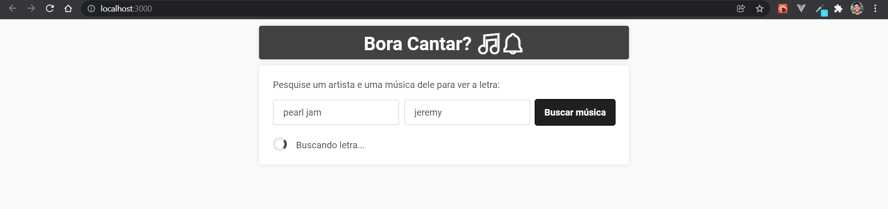
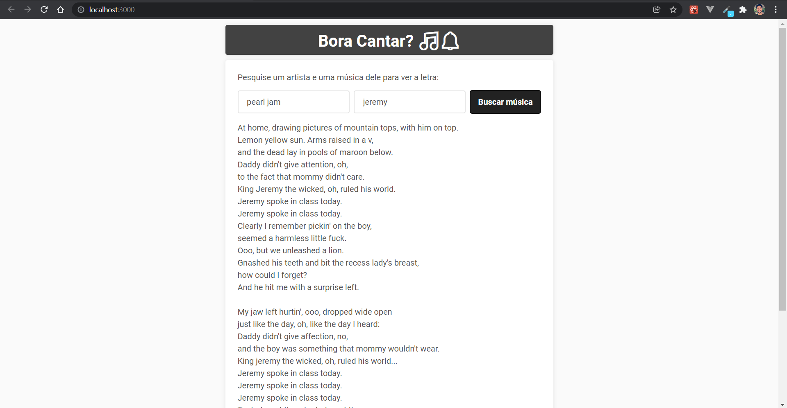
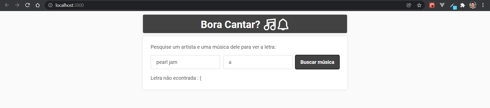

# Bora cantar?

### Depois de um tempo sem mexer com React, fiz essa pequena web page que faz requisição para uma API de letras de música.
### Basta informar o nome do artista e sua música para que a letra seja exibida em tela.
 

#### Imagens da tela:

